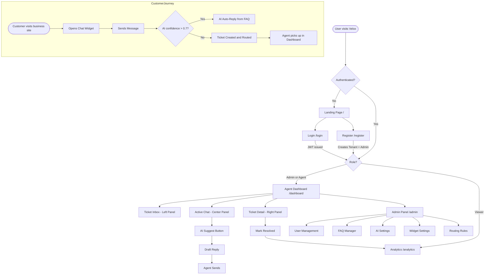
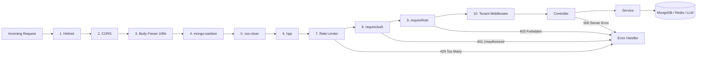

# VELOX -- Implementation Plan
**AI Customer Support Platform | Multi-Tenant SaaS | Problem Statement #1**

> Intercom + Zendesk + AI Copilot -- hackathon-executable, production-grade, security-hardened.

---

## Table of Contents

0. [Diagrams and Maps](#diagrams-and-maps)
1. [What We Are Building](#what-we-are-building)
2. [Tech Stack](#tech-stack)
3. [Architecture](#architecture)
4. [Features](#features)
5. [Pages](#pages)
6. [Backend Team](#backend-team)
7. [Frontend Team](#frontend-team)
8. [Sprint Plan](#sprint-plan)
9. [Deployment](#deployment)
10. [Testing](#testing)
11. [Demo and Pitch](#demo-and-pitch)
12. [Submission Checklist](#submission-checklist)

---

# Diagrams and Maps

## 1. System Architecture


---

## 2. App User Flow



---

## 3. Database Schema


---

## 4. Ticket Lifecycle


---

## 5. AI Decision Flow


---

## 6. Request Middleware Pipeline



---

# What We Are Building

A multi-tenant platform where businesses embed a chat widget on their site. AI auto-resolves simple customer queries from a knowledge base, creates tickets for complex ones, routes them to human agents with AI-drafted replies, and surfaces analytics on everything.

### Why We Win

| Average Team | Velox |
|---|---|
| Basic chat + AI reply | AI routing + agent productivity + clean UX |
| Single-tenant | Multi-tenant with strict data isolation |
| No scaling story | Docker + Nginx + Redis Pub/Sub -- 3 Node instances |
| Basic Helmet | Full chain: CSP, HSTS, rate limiting, NoSQL sanitization |
| Plain REST | REST + WebSockets via Socket.IO |

### User Roles

| Role | What they do |
|------|-------------|
| Admin | Creates workspace, manages team, configures AI, views analytics |
| Agent | Handles assigned tickets, uses AI suggestions, adds internal notes |
| Customer | Chats via embedded widget, no login required |
| Viewer | Read-only access to dashboards |

---

# Tech Stack

| Layer | Choice | Reason |
|-------|--------|--------|
| Frontend | React + Vite | Fast dev, hackathon standard |
| Styling | Vanilla CSS with design tokens | Neo-Brutalism compliance |
| State | Redux Toolkit | Hackathon requirement |
| Real-time client | Socket.IO Client | Auto-reconnect, room-based |
| Backend | Node.js + Express | MERN requirement |
| Database | MongoDB + Mongoose | Document-based, multi-tenant friendly |
| Cache + Pub/Sub | Redis (ioredis) | Sessions, rate limiting, Socket.IO adapter |
| Security | Helmet + middleware chain | 11 headers, CSP, HSTS |
| AI | OpenAI GPT-4o-mini or Gemini | Cloud LLM |
| Containers | Docker + Docker Compose | Multi-instance orchestration |
| Load balancer | Nginx | Round-robin + WebSocket upgrade |
| Frontend deploy | Vercel | Free tier |
| Backend deploy | Render / Railway | Free tier |
| DB host | MongoDB Atlas M0 | Free, Mumbai region |
| Redis host | Redis Cloud free tier | AOF persistence |

---

# Architecture

## The Happy Path (full request flow)

```
1. Customer opens widget -> Socket.IO connects with tenantId from API key
2. Customer sends message -> hits Express via WebSocket
3. AI classifies message -> returns { intent, confidence, sentiment, priority }
4. confidence >= 0.7? -> AI queries FAQs -> generates grounded reply -> sends back
5. confidence < 0.7? -> ticket created -> routing engine assigns to agent
6. Agent gets ticket:assigned event -> dashboard inbox updates in real-time
7. Agent opens ticket -> AI pre-drafts a suggested reply
8. Agent reviews, edits, sends -> customer sees it instantly via WebSocket
9. Ticket resolved -> analytics engine logs all metrics
```

## Middleware Stack (per request, in order)

```
Request -> Helmet -> CORS -> Body limit (10kb) -> mongo-sanitize -> xss-clean
        -> hpp -> Rate limiter -> requireAuth -> requireRole -> tenant middleware
        -> Controller -> Service -> MongoDB / Redis / LLM
```

---

# Features

## F1 -- Multi-Tenant Architecture
**Priority: Critical**

Every document stores a `tenantId`. The tenant middleware extracts this from the decoded JWT and attaches it to `req.tenant`. Every Mongoose query must filter by `{ tenantId: req.tenant }` -- no exceptions. This is the #1 security concern.

- Register creates a Tenant document + first Admin user atomically
- Widget connections authenticate via API key which maps to a tenantId
- Index every collection on `tenantId`

## F2 -- Authentication and RBAC
**Priority: Critical**

- Register: creates Tenant + Admin user in one call, returns JWT
- Login: issues access token (15 min, in-memory) + refresh token (7 days, httpOnly cookie)
- JWT payload: `{ userId, tenantId, role }`
- Passwords: bcrypt, 12 rounds
- Logout: refresh token blacklisted in Redis

**RBAC Matrix:**

| Action | Admin | Agent | Viewer |
|--------|:-----:|:-----:|:------:|
| View Dashboard | Y | Y | Y |
| Handle Tickets | Y | Y | N |
| Send Messages | Y | Y | N |
| Manage Users | Y | N | N |
| Manage FAQs | Y | N | N |
| Configure AI | Y | N | N |
| View Analytics | Y | N | N |
| Assign Tickets | Y | N | N |

## F3 -- Real-Time Chat
**Priority: Critical**

Socket.IO with `@socket.io/redis-adapter` for multi-instance delivery. Each ticket is a Socket.IO room. Chat history loads via REST on page open; live updates via WebSocket thereafter. Typing indicators are broadcast but never persisted.

## F4 -- Ticketing System
**Priority: Critical**

Lifecycle: `open -> in-progress -> resolved -> closed`

When AI confidence is below threshold or sentiment is angry, a ticket is created automatically. AI generates the title from the first message. Priority is set by sentiment analysis.

## F5 -- AI Support Assistant (Core Differentiator)
**Priority: Critical**

| Capability | Trigger | What it does |
|-----------|---------|--------------|
| Intent Classification | Every customer message | Returns intent, confidence, sentiment, priority |
| Auto-Reply | confidence >= 0.7 and FAQ match | FAQ-grounded response sent to customer |
| Agent Suggestion | Agent clicks "AI Suggest" | Drafts reply from full conversation + FAQs |
| Summarization | Agent clicks "AI Summarize" | 2-3 sentence summary stored on ticket |

**Smart Routing:** Match intent to agent specializations -> bump priority if sentiment angry -> check Redis online agents -> assign lowest-load available agent.

**Anti-hallucination:** AI is always grounded in tenant FAQ data. If it cannot answer from context, it outputs `{ escalate: true }` and a ticket is created. Agent suggestions are drafts only -- never auto-sent.

## F6 -- Agent Dashboard
**Priority: Critical**

Three-panel layout:
- Left: Ticket Inbox -- filter by Assigned to Me / Unassigned / Urgent / All Open
- Center: Chat Thread -- color-coded bubbles (customer = lavender, agent = white, AI = green dashed)
- Right: Ticket Details -- status/priority/agent dropdowns, internal notes, AI Summarize button

## F7 -- Admin Panel
**Priority: Critical**

| Tab | What it does |
|-----|-------------|
| Users | Invite agents, change roles, deactivate accounts |
| FAQ Manager | CRUD for knowledge base -- feeds the AI directly |
| AI Settings | Toggle auto-reply, confidence threshold, tone, model |
| Widget Settings | Customize widget, get embed code |
| Routing Rules | Map intent categories to specific agents |

## F8 -- Analytics Dashboard
**Priority: High**

| Metric | Target |
|--------|--------|
| Total Tickets | Stat card with trend |
| AI Resolution Rate | >= 40% |
| Avg Response Time | < 2s for AI replies |
| Avg Resolution Time | Stat card |
| Ticket Volume | Line chart (7/30 day toggle) |
| Tickets by Priority | Bar chart |
| Agent Performance | Table with resolved count and avg time |

## F9 -- Embeddable Chat Widget
**Priority: Critical**

Businesses add one `<script>` tag with their API key. Widget has fully scoped CSS, connects via Socket.IO with the API key, manages customer sessions via localStorage. Features: minimize/maximize, unread badge, typing indicator.

---

# Pages

| Route | Access | Description |
|-------|--------|-------------|
| `/` | Public | Landing -- hero, How It Works, feature cards, comparison |
| `/login` | Public | Email + password form |
| `/register` | Public | Business name, name, email, password -- creates tenant + admin |
| `/dashboard` | Agent+ | Three-panel: Inbox + Chat + Ticket Details |
| `/admin` | Admin | Tabs: Users, FAQs, AI Settings, Widget, Routing |
| `/analytics` | Admin | Stat cards + charts + agent table |
| `/settings` | Auth | Edit profile, change password, logout |
| Widget | Public (embedded) | Floating chat bubble -> chat window |
---

# Backend Team
**Akshat and Mayank -- Node.js, Express, MongoDB, Redis, AI, Docker, Nginx**

---

## Folder Structure

```
backend/
    src/
        config/
            db.js               MongoDB connection with retry logic
            redis.js            ioredis client setup
            env.js              dotenv loader -- fails fast if vars missing
        middleware/
            auth.js             Verifies JWT, attaches req.user
            rbac.js             requireRole('admin') -- checks req.user.role
            tenant.js           Extracts tenantId from JWT, attaches req.tenant
            rateLimiter.js      Redis-backed sliding window rate limiter
            security.js         Helmet + CORS + mongo-sanitize + xss + hpp
            validate.js         Joi/Zod schema validation per route
            errorHandler.js     Global error handler -- consistent JSON format
        models/
            Tenant.js
            User.js
            Ticket.js
            Message.js
            FAQ.js
            Analytics.js
        routes/
            auth.routes.js
            ticket.routes.js
            chat.routes.js
            admin.routes.js
            ai.routes.js
            analytics.routes.js
            widget.routes.js
        controllers/            One file per route group, thin -- delegates to services
        services/
            ai.service.js       LLM integration -- classify, suggest, summarize, auto-reply
            routing.service.js  Smart ticket routing logic
            cache.service.js    Redis get/set/del helpers with TTL
            analytics.service.js  Aggregation pipeline builders
        socket/
            index.js            Socket.IO server + Redis adapter init
            auth.js             Socket auth middleware
            chatHandler.js      join, leave, send, typing events
            notificationHandler.js  ticket:new, ticket:assigned events
        utils/
            generateToken.js    JWT sign/verify helpers
            prompts.js          All LLM prompt templates
            apiKey.js           Widget API key generation and validation
        server.js               Entry point -- Express + Socket.IO + middleware chain
    Dockerfile
    .env.example
    package.json```

---

## Database Schemas

### Tenants

| Field | Type | Notes |
|-------|------|-------|
| `_id` | ObjectId | -- |
| `name` | String | "Acme Corp" |
| `slug` | String | unique, indexed |
| `apiKey` | String | unique, indexed -- for widget auth |
| `plan` | String | "free" / "pro" / "enterprise" |
| `settings.ai.enabled` | Boolean | default true |
| `settings.ai.model` | String | "gpt-4o-mini" |
| `settings.ai.tone` | String | "professional" / "friendly" / "concise" |
| `settings.ai.autoReply` | Boolean | default true |
| `settings.ai.confidenceThreshold` | Number | default 0.7 |
| `settings.widget.accentColor` | String | default "#00E676" |
| `settings.widget.greeting` | String | "Hi! How can we help?" |
| `settings.routing` | Array | `[{ category, assignTo: UserId }]` |
| `createdAt` | Date | -- |

Indexes: `{ slug: 1 }`, `{ apiKey: 1 }`

---

### Users

| Field | Type | Notes |
|-------|------|-------|
| `tenantId` | ObjectId | ref Tenant -- in every query |
| `name` | String | -- |
| `email` | String | unique per tenant |
| `passwordHash` | String | bcrypt 12 rounds |
| `role` | String | "admin" / "agent" / "viewer" |
| `isActive` | Boolean | default true (soft delete) |
| `lastActive` | Date | updated on each authenticated request |
| `refreshToken` | String | hashed, for validation |

Indexes: `{ tenantId: 1, email: 1 }` compound unique, `{ tenantId: 1, role: 1 }`

---

### Tickets

| Field | Type | Notes |
|-------|------|-------|
| `tenantId` | ObjectId | in every query |
| `title` | String | AI-generated from first message |
| `status` | String | "open" / "in-progress" / "resolved" / "closed" |
| `priority` | String | "low" / "medium" / "high" / "urgent" |
| `category` | String | AI-classified intent |
| `assignedTo` | ObjectId | ref User, nullable |
| `customer.name` | String | from widget or "Anonymous" |
| `customer.email` | String | optional |
| `customer.sessionToken` | String | widget session ID |
| `internalNotes` | Array | `[{ author, content, createdAt }]` -- agent-only |
| `aiSummary` | String | AI-generated, updated on demand |
| `messageCount` | Number | denormalized for performance |
| `lastMessageAt` | Date | for inbox sort |
| `resolvedAt` | Date | nullable |

Indexes: `{ tenantId: 1, status: 1 }`, `{ tenantId: 1, assignedTo: 1 }`, `{ tenantId: 1, createdAt: -1 }`

---

### Messages

| Field | Type | Notes |
|-------|------|-------|
| `tenantId` | ObjectId | -- |
| `ticketId` | ObjectId | ref Ticket -- indexed |
| `senderType` | String | "customer" / "agent" / "ai" |
| `senderId` | ObjectId | ref User, null for customers |
| `content` | String | -- |
| `isAISuggestion` | Boolean | true if AI draft was accepted by agent |
| `createdAt` | Date | -- |

Indexes: `{ ticketId: 1, createdAt: 1 }` compound

---

### FAQs

| Field | Type | Notes |
|-------|------|-------|
| `tenantId` | ObjectId | -- |
| `question` | String | -- |
| `answer` | String | -- |
| `category` | String | used for intent-to-FAQ mapping |
| `isActive` | Boolean | default true |

Indexes: `{ tenantId: 1, category: 1 }`, `{ tenantId: 1, isActive: 1 }`

---

### Analytics (Daily Aggregates)

| Field | Type | Notes |
|-------|------|-------|
| `tenantId` | ObjectId | -- |
| `date` | Date | truncated to day |
| `totalTickets` | Number | -- |
| `resolvedByAI` | Number | -- |
| `resolvedByAgent` | Number | -- |
| `avgResponseTimeMs` | Number | -- |
| `avgResolutionTimeMs` | Number | -- |
| `ticketsByPriority` | Object | `{ low, medium, high, urgent }` |
| `ticketsByCategory` | Map | `{ "billing": 5, "technical": 3 }` |

Indexes: `{ tenantId: 1, date: -1 }`

---

## API Routes

### Auth -- `/api/auth`

| Method | Endpoint | Auth | Description |
|--------|----------|------|-------------|
| POST | `/register` | No | Creates Tenant + Admin user, returns JWT |
| POST | `/login` | No | Returns access token + sets refresh cookie |
| POST | `/refresh` | Cookie | Issues new token pair, blacklists old |
| POST | `/logout` | Yes | Blacklists refresh token in Redis |
| GET | `/me` | Yes | Returns current user (no passwordHash) |
| PUT | `/profile` | Yes | Update name or email |
| PUT | `/password` | Yes | Change password (requires current password) |

---

### Tickets -- `/api/tickets`

| Method | Endpoint | Auth | Description |
|--------|----------|------|-------------|
| GET | `/` | Agent+ | List tickets with filters: `status`, `assignedTo`, `priority`, `page`, `limit` |
| POST | `/` | Any | Create ticket + trigger AI classification + routing |
| GET | `/:id` | Agent+ | Ticket detail with populated assignedTo |
| PATCH | `/:id` | Agent+ | Update status, priority, assignment, category |
| POST | `/:id/assign` | Admin | Assign to agent |
| POST | `/:id/notes` | Agent+ | Add internal note (agent-only) |
| DELETE | `/:id` | Admin | Soft delete -- sets status to closed |

---

### Chat -- `/api/chat`

| Method | Endpoint | Auth | Description |
|--------|----------|------|-------------|
| POST | `/:ticketId/messages` | Any | Send message -- persists to DB + broadcasts via Socket.IO |
| GET | `/:ticketId/messages` | Agent+ | Paginated history, sorted ascending by createdAt |

---

### AI -- `/api/ai`

| Method | Endpoint | Auth | Description |
|--------|----------|------|-------------|
| POST | `/classify` | Internal | Classify intent -> `{ intent, confidence, sentiment, priority }` |
| POST | `/suggest-reply` | Agent+ | Full conversation + FAQs -> draft reply |
| POST | `/summarize/:ticketId` | Agent+ | Summarize thread -> update ticket.aiSummary |
| POST | `/auto-reply` | Internal | FAQ-grounded auto-reply for customer |

---

### Admin -- `/api/admin`

| Method | Endpoint | Auth | Description |
|--------|----------|------|-------------|
| GET/POST | `/users` `/users/invite` | Admin | List users / create agent account |
| PATCH | `/users/:id/role` | Admin | Change role |
| PATCH | `/users/:id/status` | Admin | Activate / deactivate |
| GET/POST | `/faqs` | Admin | List / create FAQs |
| PUT/DELETE | `/faqs/:id` | Admin | Update / delete FAQ |
| GET | `/settings` | Admin | All tenant settings |
| PUT | `/settings/ai` `/settings/widget` `/settings/routing` | Admin | Update settings |

---

### Analytics -- `/api/analytics`

All routes: Admin only. All accept `?from=YYYY-MM-DD&to=YYYY-MM-DD`.

| Endpoint | Returns |
|----------|---------|
| GET `/overview` | Stat card totals and averages |
| GET `/trends` | Ticket volume over time |
| GET `/agents` | Per-agent performance stats |
| GET `/categories` | Tickets grouped by category |

---

### Widget -- `/api/widget`

| Method | Endpoint | Auth | Description |
|--------|----------|------|-------------|
| GET | `/config/:apiKey` | None (public) | Widget display config |
| POST | `/session` | API key | Create or resume customer session |

---

## Socket.IO Events

**Connection auth:**
- Agents: `{ auth: { token: "<JWT>" } }`
- Widget: `{ auth: { apiKey: "tk_...", sessionToken: "sess_..." } }`

### Client to Server

| Event | Payload | Description |
|-------|---------|-------------|
| `chat:join` | `{ ticketId }` | Join a ticket room |
| `chat:leave` | `{ ticketId }` | Leave a ticket room |
| `chat:send` | `{ ticketId, content, senderType }` | Send message -- server persists + broadcasts |
| `chat:typing` | `{ ticketId }` | Broadcast typing indicator -- never persisted |
| `agent:status` | `{ status }` | "online" or "away" -- updates Redis set |

### Server to Client

| Event | Payload | Trigger |
|-------|---------|---------|
| `chat:message` | `{ message }` | New message in ticket room |
| `chat:typing` | `{ ticketId, user }` | Someone is typing |
| `ticket:new` | `{ ticket }` | New ticket -- broadcast to all tenant agents |
| `ticket:updated` | `{ ticket }` | Status/priority/assignment changed |
| `ticket:assigned` | `{ ticket, agentId }` | Assigned to specific agent |
| `notification:new` | `{ type, data }` | General notification |
| `ai:suggestion` | `{ ticketId, suggestion }` | AI suggestion ready |
| `ai:auto-reply` | `{ ticketId, message }` | AI sent auto-reply to customer |

---

## AI Prompt Design

All four prompts live in `utils/prompts.js`.

**Classification prompt:** Provide tenant name and list of FAQ categories as labels. Ask for intent, confidence (0.0-1.0), sentiment (positive/neutral/frustrated/angry), and suggested priority. Request JSON response.

**Auto-reply prompt:** Provide tenant name, tone setting, FAQ answers filtered by classified intent, and last 5 messages as context. Instruct: only use provided context; if unable to answer return `{ escalate: true }`; never invent information.

**Agent suggestion prompt:** Provide tenant name, full ticket conversation, relevant FAQs, ticket category and priority. Ask for a professional draft reply. Frame it as a draft for the agent to review -- not a final send.

**Summarization prompt:** Provide all messages in the ticket. Ask for 2-3 sentences covering what the customer needed, what was done, and current status.

---

## Security

### Middleware Chain (order is critical)

Apply in this exact order in `server.js`:

1. `helmet()` -- sets 11 security headers
2. `helmet.contentSecurityPolicy()` -- restrict script/style/font sources
3. `helmet.hsts()` -- enforce HTTPS for 1 year
4. `cors()` -- whitelist only frontend URL and widget URL
5. `express.json({ limit: '10kb' })` -- reject oversized payloads
6. `mongoSanitize()` -- strip `$` and `.` operators from input
7. `xss()` -- sanitize HTML entities
8. `hpp()` -- prevent HTTP parameter pollution
9. Global rate limiter -- 100 req/min per IP
10. Auth-specific rate limiter on `/api/auth` -- 5 req/min per IP

### Attack Coverage

| Attack | Defense |
|--------|---------|
| XSS | Helmet CSP + xss-clean + React auto-escapes JSX |
| NoSQL Injection | mongo-sanitize strips `$gt`, `$ne`, `$or` operators |
| Brute Force | Redis rate limiter: 5 req/min on auth routes -> 429 |
| DDoS | App-level rate limiter + Nginx `limit_req_zone` |
| CSRF | SameSite=Strict cookie + CORS origin whitelist |
| JWT Theft | Access token in-memory (15 min). Refresh token httpOnly cookie. Logout blacklists in Redis |
| Cross-Tenant Data Leak | Every Mongoose query filtered by `tenantId: req.tenant` |
| Large Payload | `express.json({ limit: '10kb' })` |
| Clickjacking | `X-Frame-Options: DENY` via Helmet |

### JWT Strategy

| Token | Storage | Expiry | Notes |
|-------|---------|--------|-------|
| Access | Redux store (in-memory) | 15 min | Never localStorage. Sent as `Authorization: Bearer` |
| Refresh | httpOnly Secure SameSite=Strict cookie | 7 days | Unreadable by JS |
| Blacklist | Redis key `bl:<jti>` | Matches token TTL | Checked before JWT verification |

---

## Horizontal Scaling

### The Problem

With a single Node.js instance, Socket.IO works fine. With 3 instances behind Nginx, Client A (Instance 1) and Client B (Instance 3) cannot communicate without a shared message bus.

### The Solution

Configure Socket.IO with `@socket.io/redis-adapter`. Create two Redis clients (pub + sub). When Instance 1 receives `chat:send`, it saves the message and emits `chat:message`. The Redis adapter publishes this to Redis -- Instances 2 and 3 subscribe, receive it, and deliver to their local clients.

### Docker Compose Services

- `nginx` -- exposed on port 80, round-robin to 3 API instances
- `api-1`, `api-2`, `api-3` -- identical Express builds, each with unique `INSTANCE_ID` env var. Use YAML anchors to avoid repetition
- `mongo` -- MongoDB 7 with volume mount
- `redis` -- Redis 7 Alpine with AOF persistence enabled

### Nginx Config

Two location blocks:
- `/api/` -- round-robin proxy. Set `X-Real-IP` and `X-Forwarded-For` so the app sees the real client IP for rate limiting
- `/socket.io/` -- requires `Upgrade` and `Connection: upgrade` headers. Use `ip_hash` for sticky sessions during Socket.IO long-polling fallback

### Verifying It Works

1. `docker-compose up --build` -- 3 instances + Redis + Mongo + Nginx
2. Login as two different agents in two browsers
3. Open the same ticket in both -- send a message from Browser 1, it appears in Browser 2
4. Check Docker logs -- confirm the two requests hit different instance IDs
5. `docker-compose stop api-2` -- app continues on instances 1 and 3

---

## Redis Strategy

| Purpose | Key Pattern | TTL |
|---------|-------------|-----|
| JWT blacklist | `bl:<jti>` | Remaining token life |
| Rate limiting | `rl:<ip>:<endpoint>` | 1 min window |
| Tenant config cache | `tenant:<id>:config` | 5 min |
| Ticket list cache | `tenant:<id>:tickets:page:<n>` | 30 sec |
| FAQ cache per category | `tenant:<id>:faqs:<category>` | 5 min |
| Analytics cache | `tenant:<id>:analytics:<range>` | 2 min |
| Online agents | `tenant:<id>:agents:online` (Set) | No expiry |
| Socket.IO Pub/Sub | Managed by adapter | -- |

**Invalidation rules:**
- On FAQ create/update/delete: invalidate `tenant:<id>:faqs:*`
- On ticket status change: invalidate matching ticket cache keys
- Ticket list and analytics caches expire by TTL

---

## Backend Task List

| # | Task | Priority | Hours |
|---|------|----------|-------|
| B1 | Express setup, folder structure, dotenv, env validation | Critical | 2h |
| B2 | MongoDB connection with retry + all 6 Mongoose models | Critical | 3h |
| B3 | Auth: register, login, JWT, refresh, me, logout | Critical | 6h |
| B4 | Tenant middleware -- extract tenantId, attach req.tenant | Critical | 1h |
| B5 | Ticket CRUD -- list paginated+filtered, create, get, update, notes | Critical | 5h |
| B6 | Chat messages -- send (persist+broadcast), paginated history | Critical | 4h |
| B7 | Socket.IO server + Redis adapter + socket auth middleware | Critical | 5h |
| B8 | Socket handlers -- chatHandler, notificationHandler | Critical | 4h |
| B9 | AI service -- intent classification | Critical | 4h |
| B10 | AI service -- FAQ-grounded auto-reply + escalation | Critical | 4h |
| B11 | AI service -- agent suggestion endpoint | High | 3h |
| B12 | AI service -- conversation summarization | High | 2h |
| B13 | Smart routing service -- category + sentiment + availability | High | 4h |
| B14 | Admin endpoints -- users, FAQ CRUD, all settings | High | 5h |
| B15 | Analytics endpoints -- aggregation pipelines | High | 4h |
| B16 | Widget endpoints -- public config + session | High | 2h |
| B17 | Security middleware chain -- Helmet, sanitize, xss, hpp | Critical | 3h |
| B18 | Redis-backed rate limiter -- global + auth-specific | Critical | 2h |
| B19 | Redis client + cache service helpers + token blacklist | Critical | 2h |
| B20 | Global error handler -- consistent JSON, async wrapper | Critical | 1h |
| B21 | Input validation -- Joi/Zod schemas for all endpoints | High | 3h |
| B22 | Dockerfile -- multi-stage build | Critical | 2h |
| B23 | Docker Compose -- 3 instances + Redis + Mongo + Nginx | Critical | 3h |
| B24 | Nginx config -- round-robin REST + ip_hash WebSocket | Critical | 2h |
| B25 | Deploy to Render/Railway + env vars + verify live URL | Critical | 3h |
| B26 | MongoDB compound indexes on all collections | High | 1h |
| B27 | Load test with autocannon -- endpoints + rate limiter check | High | 2h |
| B28 | README -- setup steps, env vars, Docker instructions | Critical | 2h |

**Suggested split:** Akshat owns B3, B5-B13 (auth, tickets, chat, WebSocket, AI). Mayank owns B1-B2, B17-B25 (infra, security, Docker, Nginx, deploy).

**Critical notes:**
- Start with B1, B2, B17, B19, B20 before anything else
- Audit every Mongoose query before submission -- confirm `tenantId: req.tenant` is in every single filter
- Test Redis adapter on Day 1 -- set up Docker with 2 instances immediately after B7
- Use `express-async-errors` to avoid unhandled promise rejections crashing the server
---

# Frontend Team
**Nikhil and Noor -- React, Redux Toolkit, Socket.IO Client, Neo-Brutalism CSS**

---

## Folder Structure

```
frontend/
    public/
        widget-loader.js        Embeddable script
    src/
        app/
            store.js            Redux configureStore with all slices
            App.jsx             Router + layout wrapper
            index.css           Global resets + font imports
        design/
            tokens.css          All CSS custom properties
            Button.jsx + .css
            Card.jsx + .css
            Input.jsx + .css
            Badge.jsx
            Modal.jsx
            Sidebar.jsx
            Toast.jsx
            Skeleton.jsx
        features/
            auth/
                authSlice.js
                Login.jsx + .css
                Signup.jsx + .css
                ProtectedRoute.jsx
            chat/
                chatSlice.js
                ChatWindow.jsx + .css
                MessageBubble.jsx
                MessageInput.jsx
                TypingIndicator.jsx
                AISuggestionPanel.jsx
            tickets/
                ticketSlice.js
                TicketInbox.jsx + .css
                TicketCard.jsx
                TicketDetail.jsx + .css
                TicketFilters.jsx
            admin/
                adminSlice.js
                AdminLayout.jsx
                UserManagement.jsx + .css
                FAQManager.jsx + .css
                AISettings.jsx
                WidgetSettings.jsx
            analytics/
                analyticsSlice.js
                AnalyticsDashboard.jsx + .css
                StatCard.jsx
                Charts.jsx
            widget/
                WidgetContainer.jsx
                WidgetChat.jsx
                Widget.css
            landing/
                LandingPage.jsx + .css
                HeroSection.jsx
                FeatureCards.jsx
                HowItWorks.jsx
        hooks/
            useSocket.js
            useAuth.js
            useDebounce.js
        utils/
            api.js              Axios instance + JWT interceptor + auto-refresh on 401
            constants.js        Role enums, status enums, priority colors
        main.jsx
    vite.config.js
    package.json```

---

## Redux Store Structure

| Slice | State Shape |
|-------|-------------|
| `authSlice` | `{ user, token, status, error }` |
| `chatSlice` | `{ activeTicketId, messages: { [ticketId]: [] }, typing: { [ticketId]: [...] }, connected }` |
| `ticketSlice` | `{ tickets: [], filters, pagination, selectedTicket }` |
| `adminSlice` | `{ users: [], faqs: [], aiSettings, widgetConfig, routingRules }` |
| `analyticsSlice` | `{ overview, trends: [], agentStats: [], status }` |
| `uiSlice` | `{ sidebarOpen, activeModal, notifications: [] }` |

All async calls use `createAsyncThunk`. The Axios instance attaches the token from store on every request and auto-calls the refresh endpoint on 401.

---

## Neo-Brutalism Design System

### Principles

- Zero border-radius -- square corners everywhere
- Hard offset shadows at 0px blur only -- no soft drop shadows
- Thick visible borders -- 2px to 4px solid black
- Pastel backgrounds on a warm off-white base
- Uppercase bold headers
- Button press animations to simulate tactility

### Token Reference

| Token | Value | Used For |
|-------|-------|----------|
| `--nb-bg` | `#FFFDF7` | Main background |
| `--nb-bg-sidebar` | `#F5F0E8` | Sidebar |
| `--nb-lavender` | `#E6E6FA` | Cards, containers |
| `--nb-yellow` | `#FFF59D` | Primary buttons |
| `--nb-green` | `#00E676` | AI elements, success |
| `--nb-pink` | `#F8BBD0` | Badges, accents |
| `--nb-blue` | `#BBDEFB` | Info, input focus |
| `--nb-peach` | `#FFCCBC` | Warnings, high priority |
| `--nb-red` | `#FF5252` | Errors, urgent |
| `--nb-border-thin` | `2px solid #000` | Message bubbles |
| `--nb-border` | `3px solid #000` | Inputs, cards |
| `--nb-border-thick` | `4px solid #000` | Headers |
| `--nb-shadow-sm` | `2px 2px 0px #000` | Hover/pressed |
| `--nb-shadow-md` | `4px 4px 0px #000` | Buttons |
| `--nb-shadow-lg` | `6px 6px 0px #000` | Cards, modals |
| `--nb-font-display` | Space Grotesk | All headings |
| `--nb-font-body` | Inter | Body text |
| `--nb-font-mono` | JetBrains Mono | Code, IDs |

### Component Rules

**Button:** 3px black border, `--nb-shadow-md`. On hover: `translate(2px, 2px)` + `--nb-shadow-sm`. On active: `translate(4px, 4px)` + no shadow.

**Card:** 2px black border, `--nb-shadow-lg`, lavender background, 0px border-radius.

**Input:** 3px black border, `--nb-shadow-sm`. On focus: blue background, `--nb-shadow-md`.

**Priority Badges:**

| Priority | Background | Text |
|----------|-----------|------|
| Low | `--nb-blue` | Black |
| Medium | `--nb-yellow` | Black |
| High | `--nb-peach` | Black |
| Urgent | `--nb-red` | White |

**Message Bubbles:**

| Sender | Background | Border |
|--------|-----------|--------|
| Customer | `--nb-lavender` | 2px solid black |
| Agent | White | 2px solid black |
| AI | `--nb-green` tinted | 2px dashed black + sparkle icon |

**Layout:** Sidebar divided by `3px solid black` vertical line. Section headers: `font-size: 2rem`, `font-weight: 800`, `text-transform: uppercase`. No rounded corners anywhere.

---

## Frontend Task List

| # | Task | Priority | Hours |
|---|------|----------|-------|
| F1 | Vite + React init, install all dependencies | Critical | 1h |
| F2 | Design tokens -- `tokens.css` with all CSS custom properties | Critical | 2h |
| F3 | Button component with press animation, all variants | Critical | 2h |
| F4 | Card component -- thick border, offset shadow | Critical | 1h |
| F5 | Input component -- thick border, pastel focus, textarea variant | Critical | 1h |
| F6 | Badge, Modal, Toast, Skeleton, Dropdown components | Critical | 3h |
| F7 | Redux store with all 6 slice scaffolds | Critical | 3h |
| F8 | Axios API service -- base URL, JWT interceptor, auto-refresh on 401 | Critical | 2h |
| F9 | Auth slice -- login/register/getMe/logout thunks | Critical | 2h |
| F10 | Login page -- form, validation, error display | Critical | 3h |
| F11 | Register page -- all fields, creates tenant, auto-redirect | Critical | 3h |
| F12 | ProtectedRoute -- check auth, redirect to /login | Critical | 1h |
| F13 | App layout -- sidebar + topbar + content area, hamburger mobile | Critical | 4h |
| F14 | Sidebar -- role-based nav links, active state, divider | Critical | 2h |
| F15 | useSocket hook -- connect with JWT, event listeners, cleanup | Critical | 3h |
| F16 | Ticket slice -- state, fetchTickets/updateTicket/assignTicket | Critical | 3h |
| F17 | Ticket Inbox (left panel) -- filter buttons, ticket cards, real-time | Critical | 5h |
| F18 | Ticket Detail (right panel) -- dropdowns, agent selector, notes | Critical | 4h |
| F19 | Chat slice -- messages map, typing, fetchMessages thunk | Critical | 2h |
| F20 | Chat Window (center panel) -- message list, auto-scroll, bubbles | Critical | 5h |
| F21 | Message Input -- text field, send button, emits chat:send + chat:typing | Critical | 2h |
| F22 | AI Suggestion Panel -- "AI Suggest" button, draft, Accept/Edit/Dismiss | Critical | 3h |
| F23 | Message Bubble -- styled per senderType, name + timestamp | Critical | 2h |
| F24 | Socket event wiring -- chat:message / ticket:new / ticket:updated -> Redux | Critical | 3h |
| F25 | Admin layout -- tabbed interface, admin role only | High | 2h |
| F26 | User Management page -- agent table, invite modal, role/status controls | High | 4h |
| F27 | FAQ Manager -- searchable list, add/edit/delete forms | High | 4h |
| F28 | AI Settings page -- toggle, threshold slider, tone + model selector | High | 2h |
| F29 | Widget Settings page -- color picker, greeting input, embed code copy | High | 2h |
| F30 | Analytics slice -- overview/trends/agentStats thunks | High | 2h |
| F31 | Analytics Dashboard -- 4 stat cards + trend indicators + agent table | High | 5h |
| F32 | Charts -- Recharts LineChart + BarChart, thick strokes, flat fills | High | 3h |
| F33 | Chat Widget -- standalone React app, scoped CSS, Socket.IO via API key | Critical | 6h |
| F34 | Widget loader script -- vanilla JS, creates iframe/shadow DOM | Critical | 2h |
| F35 | Landing page -- hero, How It Works, feature cards, comparison | High | 5h |
| F36 | Notification toasts -- real-time, auto-dismiss 5s | High | 2h |
| F37 | Profile/Settings page -- edit name/email, change password, logout | Low | 2h |
| F38 | Responsive design -- all pages at 320px, 768px, 1024px, 1440px | Critical | 4h |
| F39 | Loading and error states -- skeletons, error boundaries, empty states | High | 3h |
| F40 | Dark mode -- CSS property swap, toggle, persist in localStorage | Low | 2h |
| F41 | Micro-animations -- card hover, button press, typing dots, toast slide-in | High | 2h |

**Suggested split:** Nikhil owns F7-F24 (Redux store, auth, three-panel dashboard, real-time). Noor owns F2-F6 (design system), F25-F35 (admin, analytics, widget, landing).

**Critical notes:**
- Start with F1-F8. Design system + Redux store + API layer = foundation
- Do not wait for backend -- mock API responses from Day 1, swap to real endpoints when ready
- Neo-Brutalism is non-negotiable. Judges weight UI/UX heavily. No rounded corners, no soft shadows
- The three-panel dashboard is the "wow" moment -- spend the most time here
- Seed Redux store with demo tickets/messages so the demo does not start on an empty screen

---

# Sprint Plan

## 48-Hour Overview

| Phase | Hours | Goal |
|-------|-------|------|
| 1 -- Foundation | 0-4h | Both teams unblocked. Backend: Express + DB + Redis. Frontend: design tokens + Redux + API layer |
| 2 -- Core Build | 4-20h | Auth E2E. Tickets + Chat E2E. Real-time messaging works |
| 3 -- AI Layer | 20-32h | Classification, auto-reply, suggestions, routing all working |
| 4 -- Polish | 32-40h | Analytics, admin panel, widget, loading/error states, responsive |
| 5 -- Security and Scaling | 40-44h | Docker + Nginx running. Security verified. Deployed live |
| 6 -- Demo Prep | 44-48h | E2E tested. Pitch rehearsed. Submission ready |

---

### Phase 1 -- Foundation (Hours 0-4)

| Task | Team |
|------|------|
| Express project setup + folder structure | Backend |
| MongoDB connection + all 6 Mongoose models | Backend |
| Redis client + cache helpers | Backend |
| Global error handler | Backend |
| Vite + React init + all dependencies | Frontend |
| Design tokens CSS file | Frontend |
| All base components (Button, Card, Input, Badge, Modal, Toast, Skeleton) | Frontend |
| Redux store + all slice scaffolds | Frontend |
| Axios instance + JWT interceptor | Frontend |

### Phase 2 -- Core Build (Hours 4-20)

| Task | Team |
|------|------|
| Auth system -- register, login, JWT, refresh, me, logout | Backend |
| Tenant middleware | Backend |
| Ticket CRUD + routes | Backend |
| Chat message controller + routes | Backend |
| Socket.IO server + Redis adapter | Backend |
| Chat + notification socket handlers | Backend |
| Full security middleware chain | Backend |
| Rate limiting | Backend |
| Auth slice + Login + Register pages | Frontend |
| Protected route | Frontend |
| App layout + Sidebar | Frontend |
| useSocket hook | Frontend |
| Ticket Inbox + Ticket Detail panels | Frontend |
| Chat Window + Message Input + Message Bubble | Frontend |
| Socket event wiring to Redux | Frontend |

### Phase 3 -- AI Layer (Hours 20-32)

| Task | Team |
|------|------|
| AI classification service | Backend |
| AI auto-reply with FAQ grounding | Backend |
| AI agent suggestion endpoint | Backend |
| AI conversation summarization | Backend |
| Smart routing service | Backend |
| Admin user/FAQ/settings endpoints | Backend |
| AI Suggestion Panel in chat | Frontend |
| Admin layout + all 5 tabs | Frontend |
| Embeddable Chat Widget + loader script | Frontend |

### Phase 4 -- Polish (Hours 32-40)

| Task | Team |
|------|------|
| Analytics aggregation endpoints | Backend |
| Widget config endpoint | Backend |
| Input validation on all endpoints | Backend |
| MongoDB compound indexes | Backend |
| Analytics Dashboard + Charts | Frontend |
| Landing page | Frontend |
| Notification toasts | Frontend |
| Profile/Settings page | Frontend |
| Responsive design pass | Frontend |
| Loading + error states | Frontend |
| Dark mode + micro-animations | Frontend |

### Phase 5 -- Security and Scaling (Hours 40-44)

| Task | Team |
|------|------|
| Dockerfile multi-stage build | Backend |
| Docker Compose -- 3 instances | Backend |
| Nginx config -- load balancing + WebSocket | Backend |
| Deploy backend to Render/Railway | Backend |
| Load test with autocannon | Backend |
| Deploy frontend to Vercel | Frontend |
| Cross-browser testing | Frontend |
| Final UI audit | Frontend |

### Phase 6 -- Demo Prep (Hours 44-48)

| Task | Team |
|------|------|
| E2E flow test -- full widget to resolution journey | Both |
| README documentation | Backend |
| Demo rehearsal | Both |
| Record pitch video | Both |
| Social posts (X, LinkedIn, Instagram) | Both |
| BTS monologue/voiceover | Both |
| Discord submission | Both |

---

# Deployment

| Service | Platform | Config |
|---------|----------|--------|
| Frontend | Vercel | Build: `npm run build`, Output: `dist`, Env: `VITE_API_URL` |
| Backend | Render / Railway | Start: `node src/server.js`, set all env vars |
| Database | MongoDB Atlas M0 | Mumbai region, `retryWrites=true&w=majority` |
| Redis | Redis Cloud free tier | AOF persistence enabled |
| Scaling demo | Docker Compose locally | `docker-compose up --build` |

Required env vars: `MONGODB_URI`, `REDIS_URL`, `JWT_SECRET`, `JWT_REFRESH_SECRET`, `OPENAI_API_KEY`, `FRONTEND_URL`, `WIDGET_URL`, `NODE_ENV`, `PORT`

---

# Testing

### Backend

| Test | Method |
|------|--------|
| API testing | Thunder Client or Postman -- all endpoints |
| NoSQL injection | POST `/login` with `{ email: { "$gt": "" } }` -- must fail |
| XSS | Send `<script>alert('xss')</script>` as message -- must be sanitized |
| Brute force | Hit `/login` 10 times rapidly -- must get 429 after 5th |
| Security headers | `curl -I https://your-api-url` -- verify Helmet headers |
| Scaling | 2 browsers, same ticket, message cross-instance, kill one instance |
| Load | `npx autocannon -c 100 -d 30 http://localhost/api/tickets` |

### Frontend

- Cross-browser: Chrome, Firefox, Safari
- Responsive: 320px, 768px, 1024px, 1440px
- Real-time: 2 tabs as different agents, verify message sync
- Widget: embed in a bare HTML file, run full chat flow

### E2E Demo Flow (Run Before Submission)

| Step | Expected Result |
|------|----------------|
| Open widget on test site | Greeting message appears |
| Customer asks simple question | AI auto-replies within 2 seconds from FAQ |
| Customer asks complex question | Ticket created automatically |
| Switch to Agent Dashboard | New ticket notification appears in real-time |
| Agent opens ticket | Chat history visible + AI summary shown |
| Agent clicks "AI Suggest" | Draft reply populated |
| Agent edits and sends | Customer sees reply in widget instantly |
| Agent marks ticket resolved | Analytics dashboard reflects the resolution |
| Admin opens FAQ Manager | Adds new FAQ entry |
| Customer asks same question | AI uses new FAQ in next conversation |

---

# Demo and Pitch

### Pitch Structure

| Segment | Duration | Script |
|---------|----------|--------|
| Problem | 30 sec | "40% of support tickets are repetitive FAQs. Agents waste hours. Businesses overspend on support that AI should handle." |
| Solution | 45 sec | "Velox is an AI-first support platform. Embed our widget. AI resolves common queries instantly from your knowledge base. Complex issues escalate -- AI creates the ticket, routes it to the right agent, and drafts the reply." |
| Demo | 60 sec | Live: widget -> AI reply -> escalation -> agent dashboard -> AI suggestion -> resolution -> analytics |
| Tech depth | 30 sec | "Multi-tenant data isolation. 3 horizontally-scaled Node instances behind Nginx. Redis Pub/Sub for WebSocket sync. Full Helmet + rate limiting + NoSQL injection prevention. All in Docker." |
| Impact | 15 sec | "Sub-2s AI responses. 40%+ query automation. Agents focus only on what needs a human." |

**One-liner:** *An AI-first support platform that kills repetitive queries while keeping humans in the loop for what actually matters.*

---

# Submission Checklist

### Required

- [ ] GitHub repository with clean commits
- [ ] Live deployment link (frontend + backend accessible)
- [ ] Pitch video on Google Drive (public access)
- [ ] X (Twitter) post with pitch + link
- [ ] LinkedIn post with pitch + link
- [ ] Instagram post / story / reel
- [ ] BTS content -- monologue or voiceover showing build process

### README Must Include

- [ ] Setup steps (clone, install, env vars, run)
- [ ] Features explanation
- [ ] Tech decisions
- [ ] Architecture diagram
- [ ] How to run Docker Compose for scaling demo

### Pre-Launch

- [ ] Auth E2E: register -> login -> protected route -> token refresh -> logout
- [ ] Real-time chat: widget -> agent dashboard, sync under 1 second
- [ ] AI auto-reply: FAQ-grounded, not hallucinated
- [ ] AI suggestion: draft only, not auto-sent
- [ ] Smart routing: ticket assigned based on category
- [ ] Admin panel: all 5 tabs functional
- [ ] Analytics: charts render with real data
- [ ] Security headers: verified via `curl -I`
- [ ] Rate limiting: `/login` returns 429 on 6th attempt
- [ ] Horizontal scaling: 3 Docker instances, cross-instance WebSocket confirmed
- [ ] Responsive: tested at all 4 breakpoints
- [ ] Widget: embeds and functions on external HTML page
- [ ] No console errors in production build

---

> This document is the single source of truth. Every feature, page, task, endpoint, and event is documented here. No side channels.
